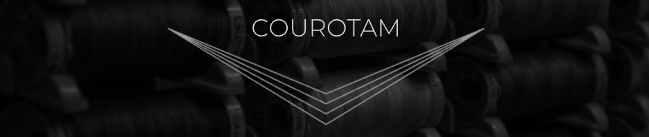

# Courotam Website

## 📖 Sobre o Projeto

O **Courotam** é um website desenvolvido para apresentar soluções em estofados de alta qualidade, voltado tanto para negócios como para residências. O site possui um layout responsivo e elegante, utilizando animações suaves e interatividade para destacar os produtos e serviços da marca.

## 🌟 Funcionalidades

- **Animação de Palavras**: A seção de cabeçalho utiliza um efeito de palavras que alternam automaticamente, destacando diferentes tipos de ambientes que podem ser transformados com os estofados.
- **Scroll Parallax**: A rolagem suave é aplicada para proporcionar uma navegação fluida e interativa.
- **Seções Interativas**: Imagens e textos ganham destaque e movimento ao passar o cursor sobre eles, proporcionando uma experiência visual dinâmica.

## 🛠️ Tecnologias Utilizadas

O site foi desenvolvido com as seguintes tecnologias:

- **Next.js**: Framework React para renderização do lado do servidor e criação de páginas dinâmicas.
- **React**: Biblioteca JavaScript para construção de interfaces de usuário.
- **TypeScript**: Superset do JavaScript que adiciona tipagem estática, aumentando a robustez do código.
- **Tailwind CSS**: Framework de estilização utilitário que facilita a criação de layouts responsivos.
- **Framer Motion**: Biblioteca para animações e transições suaves no React.
